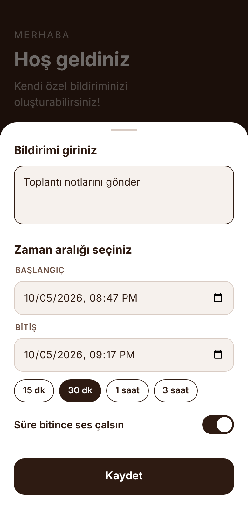
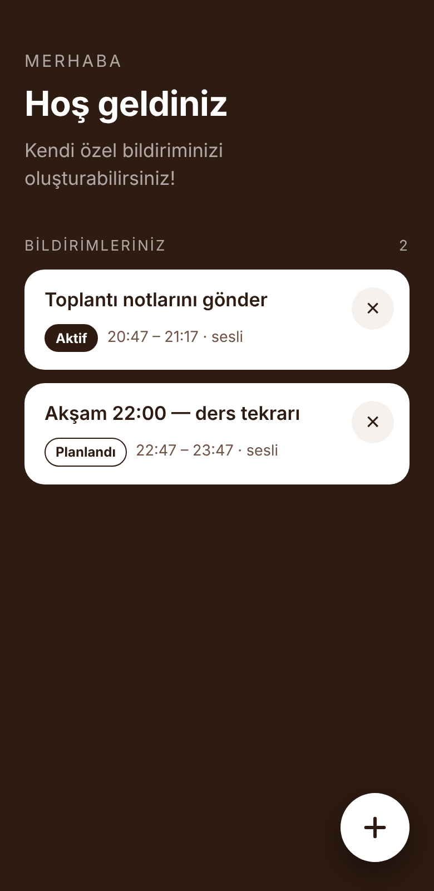

<p align="center"></p>

# Bildirimim

Kendi özel bildirimini oluştur: bir not yaz, zaman aralığını seç; not o aralık boyunca telefonunun bildirim panelinde **önemli ve kalıcı** bir bildirim olarak dursun. Süre dolunca istersen alarm sesiyle haber versin.

Hibrit bir Android uygulaması: arayüz **HTML/CSS/JS** (WebView), bildirim katmanı **native Java**.

## Ekran görüntüleri

| Ana ekran | Yeni bildirim | Liste |
|:-:|:-:|:-:|
|  |  |  |

> Görseller arayüzün (assets/index.html) önizlemesidir.

## Özellikler

- Koyu kahve + beyaz, sade ve modern arayüz
- Sağ alttaki **+** ile yeni bildirim: metin, başlangıç–bitiş zamanı, **Kaydet**
- Hızlı süre seçimi: 15 dk · 30 dk · 1 saat · 3 saat
- Aralık boyunca yüksek öncelikli, kalıcı bildirim ve bitişe geri sayım
- Bildirim kaydırılıp atılsa bile süre dolmadıysa geri gelir
- Süre bitince "Süre doldu" bildirimi; isteğe bağlı alarm sesi + titreşim
- Telefon yeniden başlatılınca planlı bildirimler yeniden kurulur
- İnternet izni yok; tüm veriler yalnızca cihazda saklanır

## Kurulum

1. [`apk/Bildirimim.apk`](apk/Bildirimim.apk) dosyasını telefona indir ve aç.
2. "Bilinmeyen kaynaklardan yükleme" iznini ver.
3. İlk açılışta bildirim iznine **İzin ver** de.

Gereksinim: **Android 8.0 (API 26)** ve üzeri.

> Xiaomi, Huawei, Oppo gibi cihazlarda pil tasarrufu arka plan alarmlarını geciktirebilir. Bildirim geç geliyorsa uygulamayı pil ayarlarından "kısıtlama yok" olarak işaretle.

## Nasıl çalışır?

```
assets/index.html  ──(window.Android köprüsü)──►  MainActivity (WebView)
                                                      │
                                    Store (SharedPreferences, JSON)
                                                      │
                                NotifReceiver ◄── AlarmManager (başlangıç / bitiş)
                                      │
                             NotificationManager (kalıcı + "süre doldu" bildirimi)
```

| Dosya | Görev |
|---|---|
| `assets/index.html` | Tüm arayüz: karşılama, liste, + butonu, bildirim formu |
| `src/.../MainActivity.java` | WebView'i açar, JS ↔ native köprüsünü (`Android.save/list/remove`) sunar, bildirim iznini ister |
| `src/.../NotifReceiver.java` | Alarmları kurar, bildirim kanallarını ve bildirimleri oluşturur, yeniden başlatmada eşitler |
| `src/.../Store.java` | Bildirimleri cihazda JSON olarak saklar |
| `res/` | Uygulama simgesi (beyaz çan, kahverengi zemin), tema ve renkler |

### İzinler

| İzin | Neden |
|---|---|
| `POST_NOTIFICATIONS` | Bildirim göstermek (Android 13+) |
| `SCHEDULE_EXACT_ALARM` / `USE_EXACT_ALARM` | Başlangıç ve bitişi tam zamanında tetiklemek |
| `RECEIVE_BOOT_COMPLETED` | Yeniden başlatma sonrası bildirimleri geri kurmak |
| `VIBRATE`, `WAKE_LOCK` | Süre dolunca titreşim ve uyandırma |

## Kaynaktan derleme

Gradle gerekmez; yalnızca JDK ve Android SDK komut satırı araçları yeterli.

```sh
# Gerekenler: JDK 11+, platforms;android-34, build-tools;34.0.0
ANDROID_HOME=/android/sdk/yolu sh build.sh
# çıktı: apk/Bildirimim.apk
```

Depodaki APK debug anahtarıyla imzalıdır. Mağazada yayınlamak için kendi anahtarınla imzala:
`KEYSTORE=/yol/anahtar.jks sh build.sh` (betikteki parola ve alias değerlerini kendi anahtarına göre düzenle).

Yalnızca arayüzü denemek için `assets/index.html` dosyasını tarayıcıda açabilirsin (tarayıcıda bildirim gönderilmez, sadece liste çalışır).

## Yol haritası

- [ ] Tekrarlayan bildirimler (her gün / haftalık)
- [ ] Kayıtlı bildirimi düzenleme
- [ ] Özel bildirim sesi seçimi
